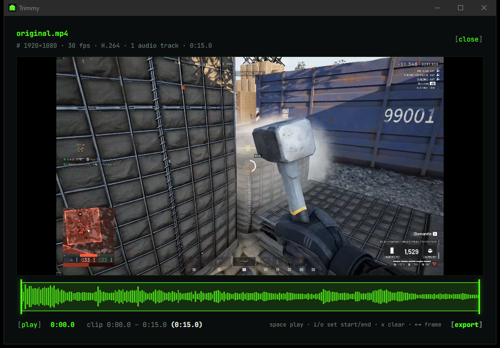

<p align="center">
  
</p>

<h1 align="center">Trimmy</h1>

<p align="center">
  <b>A comically simple video trimmer.</b><br>
  Open a clip. Drag the start and end. Export. That's the whole app.
</p>

<p align="center">
  <a href="https://github.com/TuckerScottAlleborn/trimmy/releases/latest"><b>⬇ Download for Windows</b></a>
  ·
  <a href="#using-trimmy">How to use it</a>
  ·
  <a href="#building-from-source">Build it yourself</a>
</p>



---

## Why

NVIDIA ShadowPlay, AMD ReLive, OBS and the Xbox Game Bar all save the last 30 seconds or few
minutes of gameplay at the press of a key. Most of the time you only want a few seconds of it.

Opening Clipchamp, Premiere or DaVinci Resolve for that means a timeline, tracks, a project,
and an export dialog with forty settings. Trimmy is the opposite: one video, two handles, one
button. No project files, no timeline, no account, no watermark, no upload.

## Features

- **Open anything common:** MP4, MKV, MOV, WebM, AVI, MPEG-TS, M4V, WMV, FLV and more, in H.264,
  HEVC (H.265), AV1, VP9 and others.
- **Four ways to open a file:** drag it onto the window, paste its path, browse for it
  (Ctrl+O), or right-click it in Explorer and choose **Open with → Trimmy**.
- **A timeline with the audio waveform,** so you can see where the action (the shot, the
  kill, the shout) actually is.
- **Lossless, near-instant export.** Trimmy copies the original video and audio as-is, with
  no re-encoding. A minute-long clip exports in about a second with zero quality loss.
- **Keeps every audio track.** If you record game audio and your mic on separate tracks, both
  come through.
- **Never touches your original.** The clip is saved next to it as `name_trimmed.mp4`, and
  never overwrites anything (a second export becomes `name_trimmed_2.mp4`).
- **Keyboard-driven** for fast trimming (see below).
- **No dependencies, no account, nothing uploaded.** Everything happens on your PC. FFmpeg is
  bundled inside the app.

## Download and install

1. Go to the **[latest release](https://github.com/TuckerScottAlleborn/trimmy/releases/latest)**.
2. Download **`Trimmy_x.y.z_x64-setup.exe`**.
3. Run it. It installs just for you: no admin prompt, and nothing else to install.

That's it. Trimmy appears in your Start menu.

| File | Use it when |
| --- | --- |
| `Trimmy_x.y.z_x64-setup.exe` (~60 MB) | **Almost always.** Per-user install, no admin rights needed. |
| `Trimmy_x.y.z_x64_en-US.msi` (~80 MB) | You're deploying to many PCs (Intune, Group Policy). Installs for all users and needs admin. |

Most of that size is FFmpeg, bundled so there's nothing else to install.

**"Windows protected your PC"?** The installer isn't code-signed yet (a signing certificate
costs money every year), so Windows SmartScreen warns about any new download like this. Click
**More info**, then **Run anyway**. The installers are built from this repository by
[GitHub Actions](.github/workflows/release.yml), so you can see exactly what went into them.

### System requirements

- Windows 10 or 11, 64-bit.
- That's all. Trimmy needs Microsoft's WebView2, which every up-to-date Windows 10 and 11
  PC already has; if yours somehow doesn't, the installer adds it.

### Uninstalling

**Settings → Apps → Installed apps → Trimmy → Uninstall.** Your videos and exported clips are
never touched.

## Using Trimmy

1. **Open a video.** Drag it onto the window, paste its full path into the box and press
   Enter, or click **[browse]** (Ctrl+O).
2. **Set the start and end.** Drag the green handles on the timeline, or move the playhead
   and press **I** (start here) and **O** (end here).
3. **Check it.** Press **Space** to play; playback stops at the end handle.
4. **Click [export].** The clip is saved next to the original. Click **[show in folder]** to
   find it.

### Keyboard shortcuts

| Key | Does |
| --- | --- |
| **Space** | Play / pause (plays the clip from its start) |
| **I** / **O** | Set the clip start / end at the playhead |
| **X** | Clear the start and end (back to the whole video) |
| **←** / **→** | Step one frame |
| **Shift** + **←** / **→** | Step one second |
| **Ctrl+O** | Open a video |

With a handle focused (click it or Tab to it), **←** / **→** nudge that handle instead.

### Opening from Explorer or the command line

The first time: right-click a video → **Open with** → **Choose another app** → **Choose an app
on your PC**, and pick `trimmy.exe` from `%LOCALAPPDATA%\Trimmy`. After that, Trimmy is listed
under **Open with** for that file type. You can also start it from a terminal or a script:

```powershell
& "$env:LOCALAPPDATA\Trimmy\trimmy.exe" "C:\Videos\clip.mp4"
```

## How export works (and one thing to know)

Trimmy exports with a *stream copy*: FFmpeg copies the compressed video and audio straight
into the new file instead of decoding and re-encoding them. That's why it's instant and
lossless, and why the file keeps its original codec, resolution and container.

The catch: a stream copy can only **start on a keyframe**, a full picture that the frames after
it are built from. So the clip starts at the last keyframe **at or before** your start handle.

| Recorded with | Keyframes every | So your clip may start up to |
| --- | --- | --- |
| NVIDIA ShadowPlay / NVIDIA App | ~1 second | ~1 second early |
| AMD ReLive, Xbox Game Bar | varies by settings | usually a second or two early |
| OBS (default "auto" keyframes) | up to ~8 seconds | several seconds early |

The end is always exact. A frame-exact "precise" export mode (a quick re-encode, using your
GPU when available) is on the roadmap.

## Supported formats

Trimmy opens anything FFmpeg can read that has a video track. Exports keep the original
container and codecs.

| Format | Opens and exports | Preview in the app |
| --- | --- | --- |
| MP4 / M4V / MOV, H.264 | ✅ | ✅ |
| MKV, H.264 | ✅ | ✅ |
| WebM, VP9 or AV1 | ✅ | ✅ |
| MP4, AV1 | ✅ | ✅ |
| MP4 / MOV, HEVC (H.265) | ✅ | ✅ if your PC has the free [HEVC Video Extensions](https://apps.microsoft.com/detail/9n4wgh0z6vhq), otherwise trim by timeline only |
| MPEG-TS (`.ts`, `.m2ts`) | ✅ | ❌ trim by timeline only |
| AVI, WMV, FLV and other older formats | ✅ | ❌ trim by timeline only |

When a file can't be previewed, Trimmy says so, and you can still set the start and end with
the timeline, the waveform and the time readout, then export.

Audio-only files (MP3, M4A, ...) are rejected: Trimmy is for video.

## Troubleshooting

**"Trimmy can't preview this file yet."** The built-in player (Windows' WebView2) doesn't
support that format; see the table above. Trimming and exporting still work.

**My clip starts a little before where I put the handle.** That's the keyframe rule; see
[How export works](#how-export-works-and-one-thing-to-know).

**"There's no file at ..."** Paste the full path, including the drive letter, like
`C:\Videos\clip.mp4`. Quotes around it (from Explorer's **Copy as path**) are fine.

**"That doesn't look like a video file."** FFmpeg couldn't read it. The file may be damaged,
still being written, or not a video.

**Export fails.** The error message is FFmpeg's own. The most common causes are a full disk or
saving next to a file in a read-only folder. Copy the video somewhere you can write to, like
your Desktop, and try again.

Still stuck? [Open an issue](https://github.com/TuckerScottAlleborn/trimmy/issues) with the
error text and, if you can, the output of
`ffprobe -hide_banner "your file"`.

## Building from source

### Prerequisites (Windows)

- [Node.js](https://nodejs.org) 20.19 or newer (22 LTS recommended)
- [Rust](https://rustup.rs) (stable, the default `x86_64-pc-windows-msvc` toolchain)
- Microsoft C++ Build Tools with the **Desktop development with C++** workload:
  `winget install Microsoft.VisualStudio.2022.BuildTools --override "--passive --add Microsoft.VisualStudio.Workload.VCTools --includeRecommended"`
- WebView2 (already on Windows 10 and 11)

See [Tauri's prerequisites](https://tauri.app/start/prerequisites/) for details.

### Run and build

```sh
git clone https://github.com/TuckerScottAlleborn/trimmy.git
cd trimmy
npm install
npm run tauri dev      # run the app with hot reload
npm run tauri build    # build both installers (see below)
```

The first `npm run tauri ...` downloads a pinned, SHA-256-verified FFmpeg build (about 110 MB)
into `src-tauri/bin/`, which is gitignored. After that it's skipped.

`npm run tauri build` produces:

- `src-tauri/target/release/bundle/nsis/Trimmy_<version>_x64-setup.exe`
- `src-tauri/target/release/bundle/msi/Trimmy_<version>_x64_en-US.msi`

The C runtime is linked statically (`src-tauri/.cargo/config.toml`), so the installed app
doesn't need the Visual C++ Redistributable.

### Checks

```sh
npm run check                      # Svelte + TypeScript type check
cd src-tauri && cargo test         # Rust unit tests
cd src-tauri && cargo clippy --all-targets
```

### Test clips

Build a full set of test videos (H.264, HEVC, AV1, VP9, MKV, MOV, TS, AVI, two audio tracks, no
audio) from any real recording. The optional second file is any long audio file (a DJ mix, a
podcast), used to build an hour-long video by looping the clip under it:

```sh
npm run test-clips -- "C:\path\to\clip.mp4" ["C:\path\to\long-audio.mp3"]
```

They land in `test-clips/` (gitignored).

### Project layout

```
src/                         UI (Svelte 5 + TypeScript)
  App.svelte                 Open screen vs. editor, drag and drop, Ctrl+O
  lib/OpenScreen.svelte      Path box and browse button
  lib/Editor.svelte          Preview, controls, keyboard shortcuts, export
  lib/Timeline.svelte        Waveform, handles and playhead
  lib/video.ts               Typed calls into the Rust side, time formatting
src-tauri/                   Rust backend (Tauri 2)
  src/main.rs                Tauri commands
  src/probe.rs               Reads ffprobe's report on a file
  src/export.rs              Cuts the clip (FFmpeg stream copy), names the output
  src/waveform.rs            Audio peaks for the timeline
  tauri.conf.json            App, window and installer config
  icons/icon.svg             Glitch, the app icon (all other icons are generated from it)
scripts/fetch-ffmpeg.mjs     Downloads the pinned FFmpeg sidecars and license
scripts/make-test-clips.mjs  Builds the test clip set
.github/workflows/release.yml  Builds the installers and drafts a GitHub Release
```

### How it fits together

| Piece | Job |
| --- | --- |
| [Tauri 2](https://tauri.app) (Rust) | The app window and the commands that run FFmpeg |
| [Svelte 5](https://svelte.dev) + TypeScript + Vite | The UI, rendered by Windows' built-in WebView2 |
| [FFmpeg](https://ffmpeg.org) + ffprobe | All the real video work: reading files, the waveform, exporting |

FFmpeg and ffprobe ship inside the app as [Tauri sidecars](https://v2.tauri.app/develop/sidecar/):
separate programs that the Rust side runs, never linked into Trimmy itself.

To regenerate the icons after editing `src-tauri/icons/icon.svg`:
`npx tauri icon src-tauri/icons/icon.svg` (then delete the `android/` and `ios/` folders it creates).

## Releasing

1. Bump the version in `package.json`, `src-tauri/tauri.conf.json` and `src-tauri/Cargo.toml`.
2. Commit, then tag and push: `git tag v0.2.0 && git push origin v0.2.0`.
3. The [Release workflow](.github/workflows/release.yml) builds both installers on Windows and
   attaches them to a **draft** release. Check it, then click **Publish**.

You can also run the workflow by hand from the **Actions** tab; the installers are then
attached to that run as a downloadable artifact instead.

## Roadmap

- Precise (frame-exact) export, GPU-accelerated
- Preview for formats WebView2 can't play (HEVC without the extension, TS, AVI)
- Remove audio / pick which audio track to keep
- Export for Discord (a size target, like under 10 MB)
- GIF export
- macOS and Linux builds

Simplicity is the feature. Anything that would add a second screen, a project file or a
settings page probably doesn't belong here.

## License

Trimmy is released under the [MIT License](LICENSE).

It bundles third-party software, each under its own license (copies are installed in the
app's `licenses` folder):

- **[FFmpeg](https://ffmpeg.org)** 9.0.2, the "essentials" Windows build by
  [gyan.dev](https://www.gyan.dev/ffmpeg/builds/), licensed under the **GNU GPL v3**. It runs as
  a separate program and is not linked into Trimmy. Its source code is available from
  [ffmpeg.org](https://ffmpeg.org/download.html#releases) and the exact build from
  [GyanD/codexffmpeg](https://github.com/GyanD/codexffmpeg/releases/tag/9.0.2).
- **[JetBrains Mono](https://www.jetbrains.com/lp/mono/)**, the UI font, under the SIL Open Font
  License 1.1.
